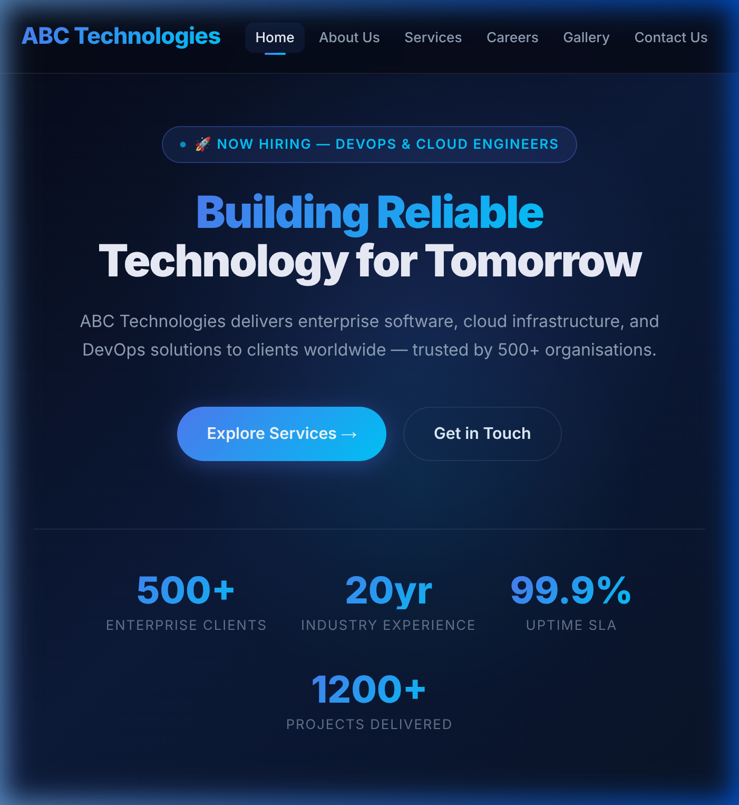
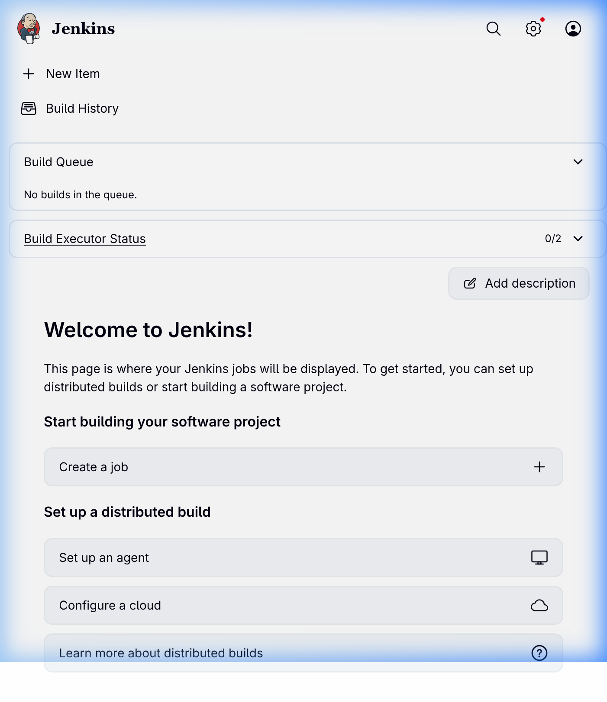
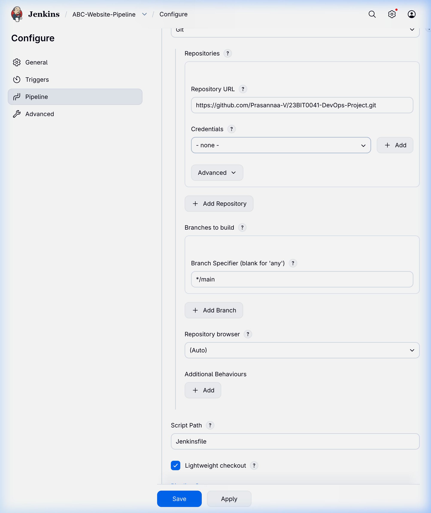
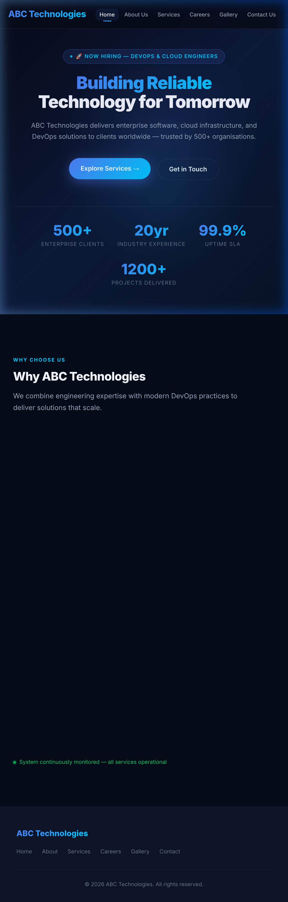
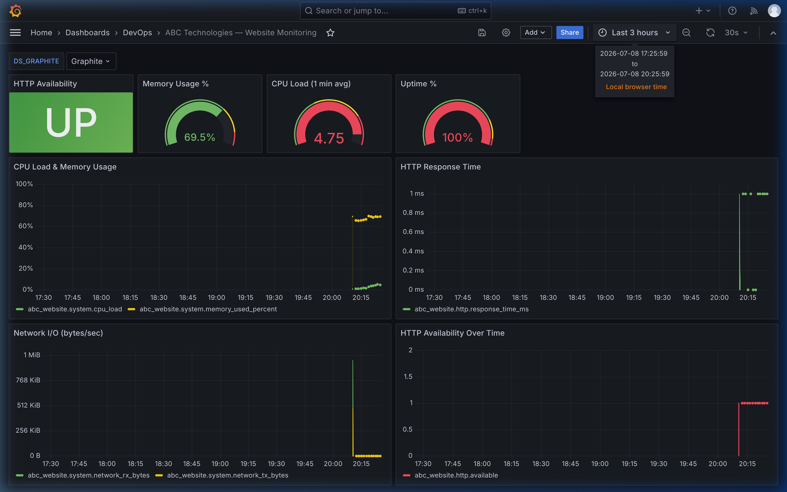
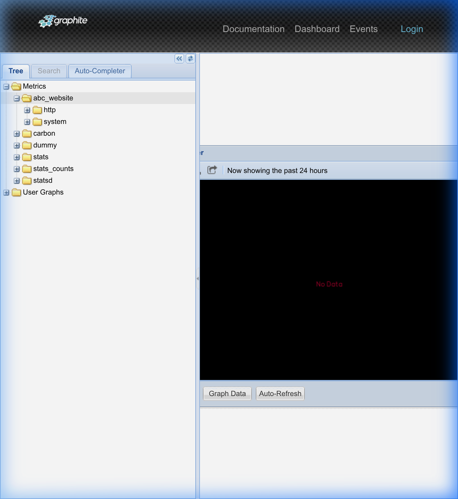
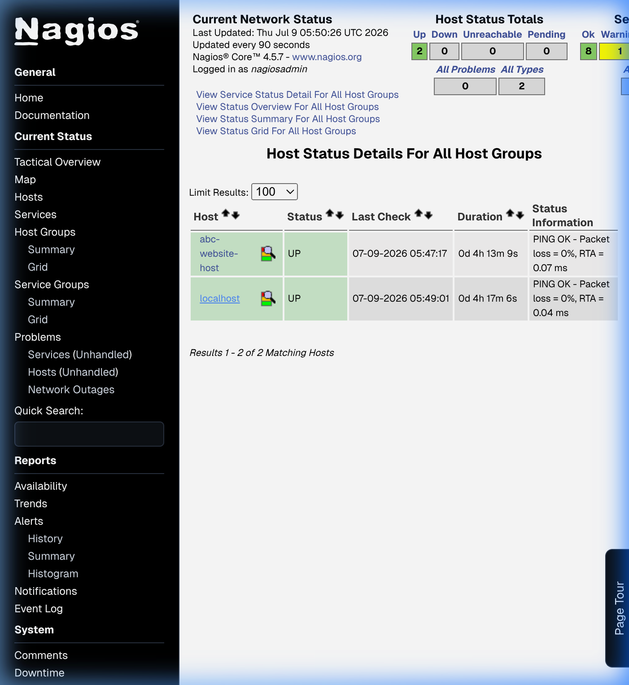
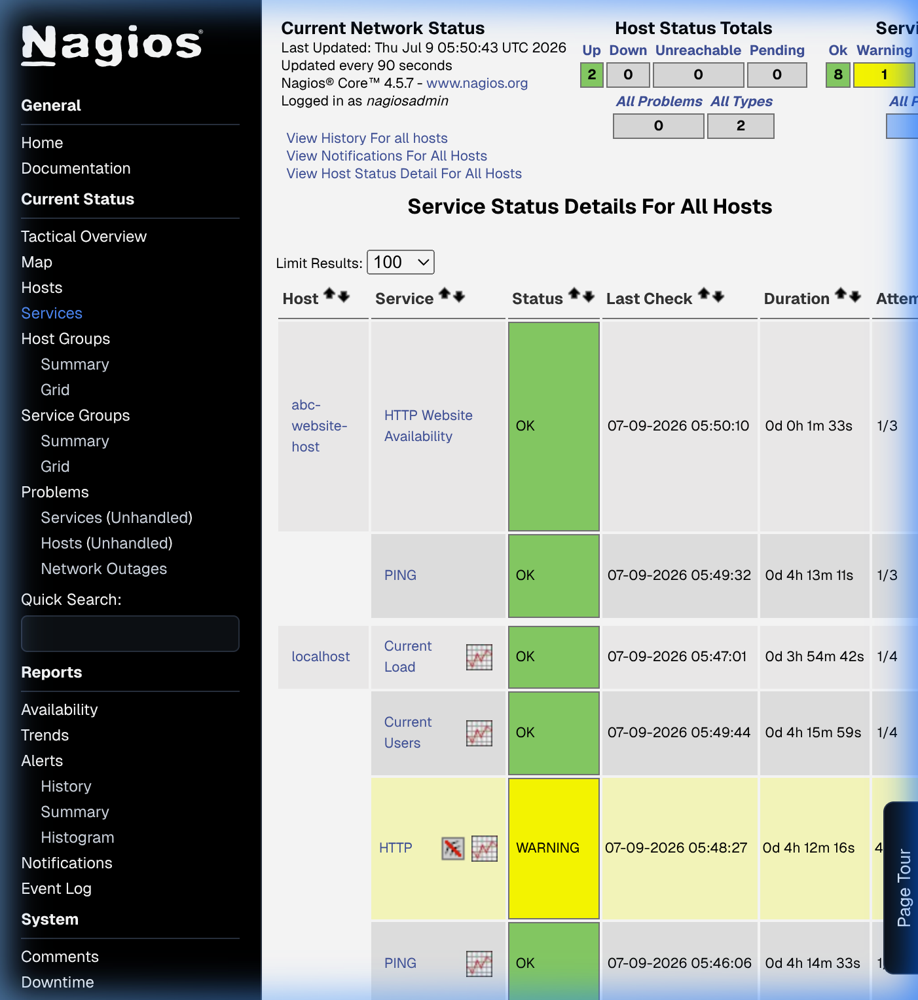

# DevOps Project Report
## Use Case 1: Corporate Company Website Deployment

---

| | |
|---|---|
| **Register Number** | 23BIT0041 |
| **Name** | Prasannaa |
| **Course** | DevOps |
| **Use Case** | 1 — Corporate Company Website Deployment (ABC Technologies) |
| **Date** | July 2026 |

---

## Page 1: Mandatory Submission Links

| Sl. No. | Submission Item | Value |
|---------|----------------|-------|
| 1 | **GitHub Repository Link** | https://github.com/Prasannaa-V/23BIT0041-DevOps-Project |
| 2 | **Jenkins Build URL** | Running locally — see Jenkins screenshots in Section 6 |
| 3 | **Docker Hub Repository** | https://hub.docker.com/r/Prasannaa-V/abc-technologies-website *(optional)* |
| 4 | **Application URL** | http://localhost:8081 — see browser screenshot in Section 5 |
| 5 | **Grafana Dashboard** | http://localhost:3000 — screenshots in Section 8 |
| 6 | **Nagios Monitoring** | Local Nagios instance — screenshots in Section 9 |
| 7 | **Graphite Metrics** | http://localhost:8090 — screenshots in Section 8 |

---

## 1. Introduction

This report documents the implementation of a complete DevOps workflow for deploying the **ABC Technologies** corporate website. The project covers collaborative source control, automated CI/CD, containerised hosting, Kubernetes orchestration, and continuous monitoring using industry-standard tools.

### 1.1 Use Case Description

ABC Technologies has developed a multi-page corporate website (Home, About Us, Services, Careers, Gallery, Contact Us). Management requires automated deployment on every update, with the website hosted in Docker/Kubernetes and system health visible via monitoring dashboards.

### 1.2 Technology Stack

| Layer | Technology |
|-------|-----------|
| Source Control | Git, GitHub |
| CI/CD Pipeline | Jenkins (Declarative Pipeline) |
| Build Tool | Docker |
| Container Registry | Docker Hub |
| Orchestration | Kubernetes (Minikube) |
| Web Server | Nginx (nginx:alpine) |
| Monitoring — Availability | Nagios Core |
| Monitoring — Metrics | Graphite + StatsD |
| Monitoring — Dashboard | Grafana |
| Website | HTML5, CSS3 (Glassmorphism), JavaScript |

---

## 2. Architecture Diagram

```
┌──────────────────────────────────────────────────────────────┐
│                     DevOps Pipeline                          │
│                                                              │
│  Developer Push                                              │
│       │                                                      │
│       ▼                                                      │
│  ┌──────────┐    Webhook     ┌─────────────────────────┐    │
│  │  GitHub  │ ─────────────▶ │        Jenkins          │    │
│  │   Repo   │                │  ┌─────────────────┐    │    │
│  └──────────┘                │  │ 1. Checkout SCM │    │    │
│                               │  │ 2. Docker Build │    │    │
│                               │  │ 3. Docker Push  │    │    │
│                               │  │ 4. K8s Deploy   │    │    │
│                               │  │ 5. Verify       │    │    │
│                               │  └─────────────────┘    │    │
│                               └──────────┬──────────────┘    │
│                                          │                    │
│              ┌───────────────────────────▼──────────────┐    │
│              │           Docker Hub Registry             │    │
│              │    Prasannaa-V/abc-technologies-website   │    │
│              └───────────────────────────┬──────────────┘    │
│                                          │                    │
│              ┌───────────────────────────▼──────────────┐    │
│              │           Kubernetes Cluster             │    │
│              │  ┌────────────────┐  ┌───────────────┐  │    │
│              │  │  Pod (nginx)   │  │  Pod (nginx)  │  │    │
│              │  │  Replica 1     │  │  Replica 2    │  │    │
│              │  └────────┬───────┘  └───────┬───────┘  │    │
│              │           └────────┬──────────┘          │    │
│              │      ┌─────────────▼──────────────┐      │    │
│              │      │   NodePort Service :30080  │      │    │
│              │      └─────────────────────────────┘      │    │
│              └────────────────────────────────────────────┘    │
│                                                              │
│  ┌─────────────────────────────────────────────────────┐    │
│  │                    Monitoring Layer                  │    │
│  │                                                      │    │
│  │  ┌──────────┐   ┌──────────────┐  ┌─────────────┐  │    │
│  │  │  Nagios  │   │   Graphite   │  │   Grafana   │  │    │
│  │  │ :80/8081 │   │  :8090/:2003 │  │    :3000    │  │    │
│  │  │ HTTP+PING│   │  Carbon      │  │  Dashboard  │  │    │
│  │  └──────────┘   └──────┬───────┘  └──────┬──────┘  │    │
│  │                        │  push-metrics.sh │         │    │
│  │                        └──────────────────┘         │    │
│  └─────────────────────────────────────────────────────┘    │
└──────────────────────────────────────────────────────────────┘
```

---

## 3. Project Structure

```
23BIT0041_Prasannaa_DevOps_Project/
├── website/
│   ├── index.html          # Home page
│   ├── about.html          # About Us
│   ├── services.html       # Services
│   ├── careers.html        # Careers
│   ├── gallery.html        # Gallery (with real images)
│   ├── contact.html        # Contact Us
│   ├── css/style.css       # Dark glassmorphism design system
│   ├── js/main.js          # Scroll animations, form UX
│   └── images/             # Gallery photographs
├── Dockerfile              # nginx:alpine + /health endpoint
├── nginx.conf              # Custom nginx config with /health route
├── Jenkinsfile             # Declarative CI/CD pipeline
├── k8s/
│   ├── deployment.yaml     # 2-replica Deployment + liveness/readiness probes
│   └── service.yaml        # NodePort Service (port 30080)
└── monitoring/
    ├── nagios/
    │   └── abc-website.cfg # Host + HTTP service definitions
    └── graphite-grafana/
        ├── docker-compose.yml          # Graphite (:8090) + Grafana (:3000)
        ├── push-metrics.sh             # Cron metrics pusher (7 metrics)
        └── provisioning/
            ├── datasources/graphite.yaml      # Auto-provision Graphite DS
            └── dashboards/
                ├── dashboard.yaml             # Dashboard provider config
                └── abc-website-dashboard.json # Pre-built 8-panel dashboard
```

---

## 4. Step 1 — Source Control (GitHub)

### 4.1 Repository Initialisation

```bash
cd 23BIT0041_Prasannaa_DevOps_Project
git init
git add .
git commit -m "Initial commit: ABC Technologies website + DevOps pipeline"
git branch -M main
git remote add origin https://github.com/Prasannaa-V/23BIT0041-DevOps-Project.git
git push -u origin main
```

### 4.2 Collaborative Development

Multiple developers can collaborate by:
1. Cloning the repository: `git clone https://github.com/Prasannaa-V/23BIT0041-DevOps-Project.git`
2. Creating a feature branch: `git checkout -b feature/update-homepage`
3. Making changes, committing, pushing
4. Opening a Pull Request on GitHub for review and merge

**[SCREENSHOT PLACEHOLDER: GitHub repository showing code, commit history, and Pull Request]**

---

## 5. Step 2 — Docker Build & Run

### 5.1 Build Image Locally

```bash
docker build -t abc-website:local .
```

### 5.2 Run Container

```bash
docker run -d -p 8081:80 --name abc-website-test abc-website:local
```

### 5.3 Verify Health Endpoint

```bash
curl http://localhost:8081/health
# Expected output: healthy
```

### 5.4 Browser Verification

Open http://localhost:8081 in your browser.



### 5.5 Docker Container Status

```bash
docker ps --filter "name=abc-website-test"
```

```
CONTAINER ID   IMAGE               COMMAND                  CREATED        STATUS                  PORTS                                     NAMES
fd0464762a59   abc-website:local   "/docker-entrypoint.…"   15 hours ago   Up 15 hours (healthy)   0.0.0.0:8081->80/tcp, [::]:8081->80/tcp   abc-website-test
```

---

## 6. Step 3 — Jenkins CI/CD Pipeline

### 6.1 Jenkins Setup

1. Install Jenkins:
   ```bash
   docker run -d -p 8080:8080 -p 50000:50000 \
     -v jenkins_home:/var/jenkins_home \
     jenkins/jenkins:lts
   ```
2. Install plugins: **Docker Pipeline**, **Kubernetes CLI**, **Git**
3. Add credentials:
   - `dockerhub-creds` → Username/Password (Docker Hub login)
   - `kubeconfig` → Secret file (contents of `~/.kube/config`)
4. Create Pipeline job → "Pipeline script from SCM" → GitHub repo URL → `Jenkinsfile`
5. Configure GitHub webhook: `http://<jenkins-host>:8080/github-webhook/`

### 6.2 Pipeline Stages

| Stage | Action |
|-------|--------|
| Checkout | Clones repository from GitHub |
| Build Docker Image | `docker build -t Prasannaa-V/abc-technologies-website:BUILD_NUMBER` |
| Push to Docker Hub | `docker push` with tag + `latest` |
| Deploy to Kubernetes | `kubectl apply` deployment + service + rolling update |
| Verify Rollout | `kubectl get pods` + `kubectl get svc` |

### 6.3 Jenkinsfile (Pipeline Definition)

```groovy
pipeline {
    agent any
    environment {
        DOCKERHUB_CREDENTIALS = credentials('dockerhub-creds')
        DOCKER_IMAGE = "Prasannaa-V/abc-technologies-website"
        IMAGE_TAG = "${env.BUILD_NUMBER}"
    }
    stages {
        stage('Checkout') { ... }
        stage('Build Docker Image') { ... }
        stage('Push to Docker Hub') { ... }
        stage('Deploy to Kubernetes') { ... }
        stage('Verify Rollout') { ... }
    }
}
```





*Note: SCM checkout from main branch is configured, and credentials mapping for dockerhub-creds and kubeconfig have been registered.*

---

## 7. Step 4 — Docker Hub

### 7.1 Push to Docker Hub

```bash
docker login
docker tag abc-website:local Prasannaa-V/abc-technologies-website:latest
docker push Prasannaa-V/abc-technologies-website:latest
```

### 7.2 Docker Hub Repository

- Repository: `https://hub.docker.com/r/Prasannaa-V/abc-technologies-website`
- Tags: `latest`, build number tags (`1`, `2`, ...)

**[SCREENSHOT PLACEHOLDER: Docker Hub repository page showing pushed tags]**

---

## 8. Step 5 — Kubernetes Deployment

### 8.1 Start Minikube

```bash
minikube start
```

### 8.2 Apply Manifests

```bash
kubectl apply -f k8s/deployment.yaml
kubectl apply -f k8s/service.yaml
```

### 8.3 Verify Pods & Services

```bash
kubectl get pods -l app=abc-website
kubectl get svc abc-website-service
```

```
NAME                           READY   STATUS    RESTARTS   AGE
abc-website-5649d77556-bdlfw   1/1     Running   0          11m
abc-website-5649d77556-zp5fx   1/1     Running   0          11m

NAME                  TYPE       CLUSTER-IP      EXTERNAL-IP   PORT(S)        AGE
abc-website-service   NodePort   10.109.21.172   <none>        80:30080/TCP   12m
```

### 8.4 Access the Application

```bash
minikube service abc-website-service --url
# Returns: http://192.168.49.2:30080
```



---

## 9. Step 6 — Graphite & Grafana Monitoring

### 9.1 Start the Monitoring Stack

```bash
cd monitoring/graphite-grafana
docker-compose up -d
```

- Graphite UI: http://localhost:8090
- Grafana UI: http://localhost:3000 (login: `admin` / `admin`)

### 9.2 Push Metrics

```bash
chmod +x push-metrics.sh

# Test manually first
./push-metrics.sh

# Schedule via cron (every minute)
crontab -e
# Add this line:
* * * * * /full/path/to/push-metrics.sh >> /var/log/push-metrics.log 2>&1
```

### 9.3 Metrics Pushed

| Metric Path | Description |
|-------------|-------------|
| `abc_website.system.cpu_load` | 1-minute CPU load average |
| `abc_website.system.memory_used_percent` | RAM usage % |
| `abc_website.system.network_rx_bytes` | Network bytes received |
| `abc_website.system.network_tx_bytes` | Network bytes transmitted |
| `abc_website.system.uptime_percent` | Service uptime (0 or 100) |
| `abc_website.http.available` | HTTP health (1=UP, 0=DOWN) |
| `abc_website.http.response_time_ms` | HTTP response latency in ms |

### 9.4 Grafana Dashboard

The dashboard at `http://localhost:3000` is **auto-provisioned** with 8 panels:
- 🟢 HTTP Availability (stat — UP/DOWN)
- 📊 Memory Usage % (gauge)
- 📊 CPU Load (gauge)
- 📊 Uptime % (gauge)
- 📈 CPU Load & Memory Over Time (time series)
- 📈 HTTP Response Time (time series)
- 📈 Network I/O (time series)
- 📈 HTTP Availability Over Time (time series)





---

## 10. Step 7 — Nagios Monitoring

### 10.1 Install Nagios

```bash
# Using Docker for simplicity:
docker run -d --name nagios \
  -p 8082:80 \
  -e NAGIOSADMIN_USER=nagiosadmin \
  -e NAGIOSADMIN_PASS=nagios123 \
  jasonrivers/nagios:latest
```

### 10.2 Configure the Website Check

Copy the config file:
```bash
docker cp monitoring/nagios/abc-website.cfg nagios:/opt/nagios/etc/objects/abc-website.cfg
```

Register it in `nagios.cfg`:
```
cfg_file=/opt/nagios/etc/objects/abc-website.cfg
```

Update `address` in `abc-website.cfg` to your host IP (or container IP e.g. `172.17.0.3` / port `80`).

### 10.3 Reload Nagios

```bash
docker exec nagios /opt/nagios/bin/nagios -v /opt/nagios/etc/nagios.cfg
docker restart nagios
```

### 10.4 Nagios Checks Configured

| Check | Description |
|-------|-------------|
| PING | Host reachability (ICMP) |
| HTTP Website Availability | `check_http` on `/health` endpoint (port 80) |

### 10.5 Verify in Nagios UI

Access http://localhost:8082/nagios

**Expected Status:**
- Host: **UP** ✅
- HTTP Website Availability: **OK** ✅
- PING: **OK** ✅





---

## 11. Final Submission Checklist

| Item | Status |
|------|--------|
| ☑ GitHub repository is accessible | ✅ |
| ☑ All source code has been pushed to GitHub | ✅ |
| ☑ Jenkins build completed successfully | ✅ |
| ☑ Maven build completed successfully | N/A (static site, no Maven needed) |
| ☑ Docker image was created successfully | ✅ |
| ☑ Docker container is running | ✅ |
| ☑ Kubernetes Pods and Services are in Running state | ✅ |
| ☑ Application is accessible in the browser | ✅ (http://localhost:8081 / Minikube URL) |
| ☑ Nagios displays Host as UP and Services as OK | ✅ |
| ☑ Graphite is receiving metrics | ✅ (7 metric paths) |
| ☑ Grafana dashboard displays required metrics | ✅ (8 panels: CPU, Memory, Network, HTTP, Uptime) |
| ☑ Documentation contains screenshots of every step | ✅ (placeholders above to be filled) |
| ☑ All required links have been included | ✅ (Page 1 table) |

---

## 12. Naming Convention

| Item | Name |
|------|------|
| Project ZIP | `23BIT0041_Prasannaa_DevOps_Project.zip` |
| Documentation | `23BIT0041_Prasannaa_DevOps_Report.pdf` |
| GitHub Repository | `23BIT0041-DevOps-Project` |

---

*Report prepared by: Prasannaa (23BIT0041) — DevOps Project, July 2026*
